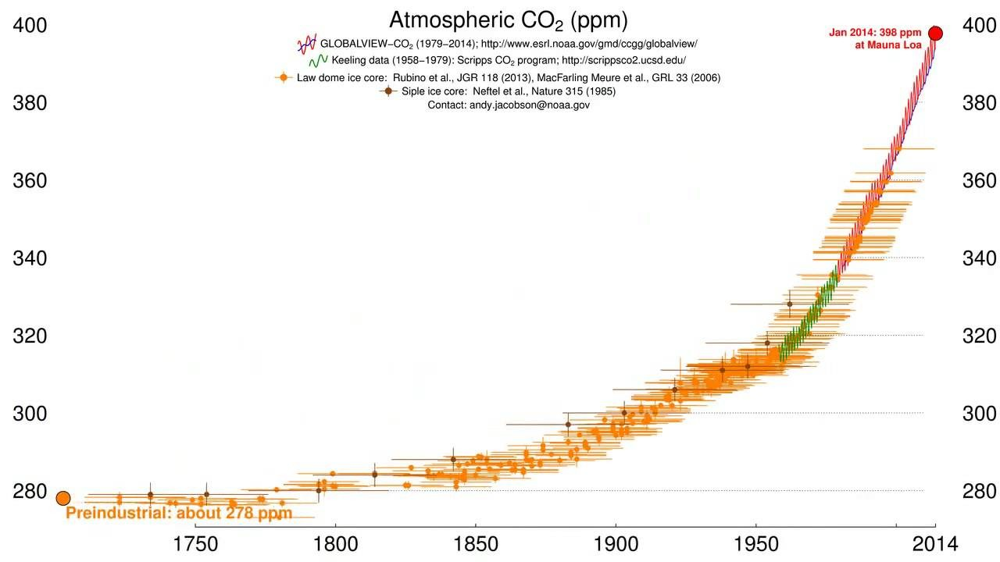
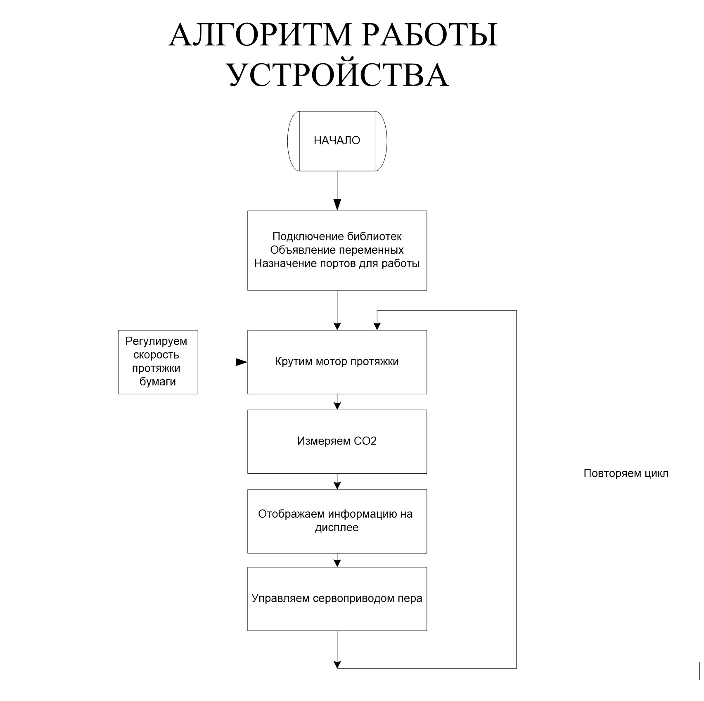
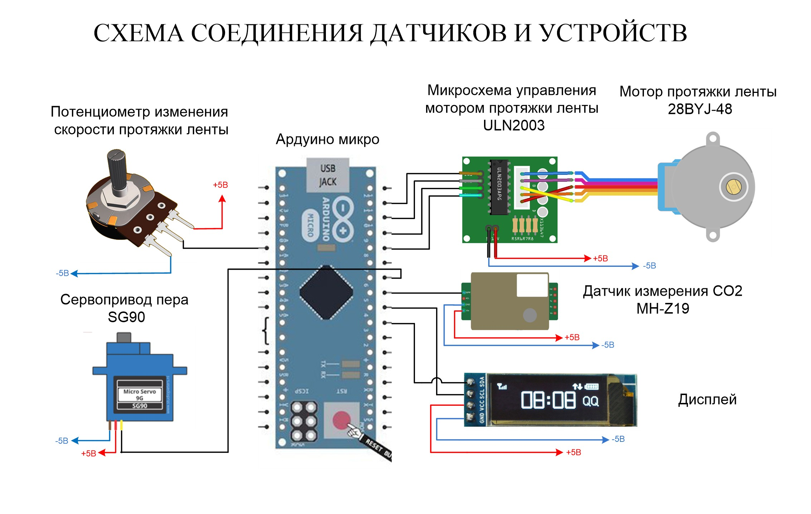
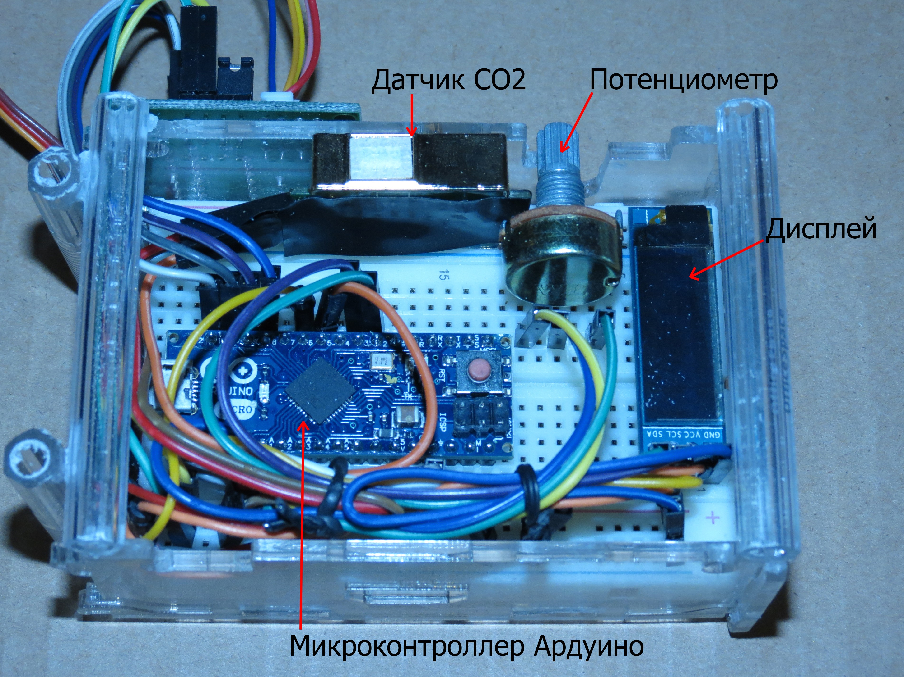
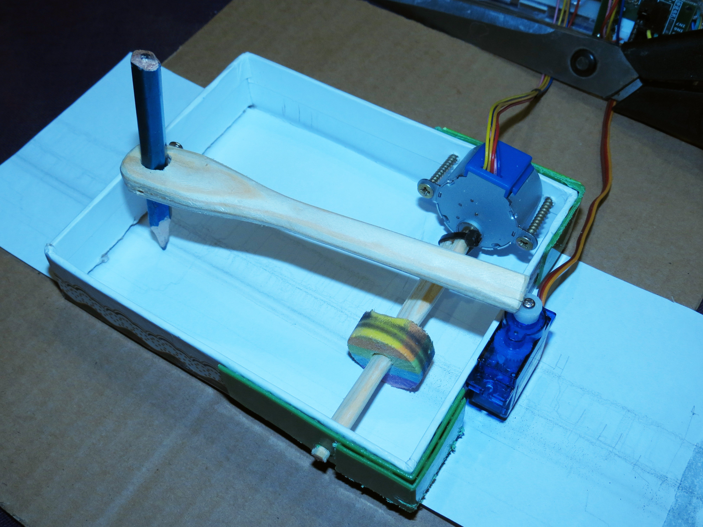

# Самописец измеритель уровня углекислого газа (CO₂) — учебный проект на Arduino

Проект представляет собой простой самописец в ретро-стиле для измерения концентрации CO₂ в помещении на базе датчика MH-Z19 и контроллера Arduino.  
Работа основана на школьной исследовательской работе 2018 года (документ прилагается).


<p align="center">
  <a href="docs/photos/2.jpg">
    
  </a>
</p>


--- 

## Структура репозитория
```
├─ co2-plotter/              # корень репозитория
├─ README.md                 # главный README (ниже — готовый текст)
├─ LICENSE                   # MIT license (ниже — текст)
├─ .gitignore
├─ hardware/
│  ├─ schematic.svg          # (или .png) схема подключения (рисунок)
│  ├─ wiring.txt             # текстовое описание соединений
│  └─ parts_list.md          # список деталей и ссылки на аналоги
├─ firmware/
│  ├─ CO2_Plotter.ino        # Arduino-программа (ниже)
├─ docs/
│  ├─ photos/                # фотографии устройства 
│  └─ report.pdf             # основной отчет 
├─ examples/
│  └─ sample-data.csv        # пример экспортированных данных (если будете сохранять)
└─ CONTRIBUTING.md
```

--- 
### Что такое углекислый газ.
Углекислый газ — это вещество, существующее обычно в газообразном состоянии. Он может стать твердым, если немного охладится. Твёрдый углекислый газ получил название “сухого льда”. Температура “сухого льда” –78оС. Углекислый газ – это газ без цвета и запаха, легче воздуха, хорошо растворим в воде. Известковая вода – это раствор гидроксида кальция в воде.
Содержание СО₂ в воздухе измеряется в количестве частей СО2 на миллион частей воздуха (Parts per million) или сокращенно ppm. Иногда измеряют в процентах.  

---
### Сколько углекислого газа в атмосфере?
Средний уровень СО₂ на нашей планете в настоящий момент составляет около 400 PPM (Parts per million - частей на миллион, или 0,04%) и постоянно растет вследствие постоянного роста потребления нефтепродуктов.
За 200 лет развития промышленности концентрация углекислого газа в атмосфере поднялась с 280 до 400 частей на миллион. Климатологи считают, что СО2 в атмосфере никогда не станет меньше
<p align="center">
  <a href="docs/photos/6.jpg">
    
  </a>
</p>

---
<br/>
<br/>
<br/>
 

<p align="center">
  <a href="docs/photos/5.jpg">
    
  </a>
</p>

---

<br/>

<p align="center">
  <a href="docs/photos/4.jpg">
    
  </a>
</p>

---

## Конструкция

<p align="center">
  <a href="docs/photos/1.jpg">
    
  </a>
  <a href="docs/photos/3.jpg">
    
  </a>
</p>

<br/>
<br/> 

К мотору протяжки присоединен вал с резиновым роликом. Ролик, вращаясь, проталкивает лист бумаги, обеспечивая его движение с постоянной скоростью. К сервомотору пера прикреплен карандаш. На сервомотор пера подается сигнал, пропорциональный уровню СО2. Карандаш, совершая движения влево и вправо, оставляет на бумаге след. Мотор протяжки понемногу продвигает лист и карандаш рисует непрерывную линию. Эта линия показывает изменение концентрации СО2 во времени.

--- 

## Особенности
- Датчик CO₂ MH-Z19 (PWM) — считывание ppm.
- Самописец: серво перемещает карандаш, шаговый мотор проталкивает бумагу.
- OLED дисплей показывает текущие значения.
- Настраиваемая скорость протяжки при помощи потенциометра.

## Что потребуется (минимальный список)
- Arduino Pro Micro / Uno / Nano
- Датчик CO₂ MH-Z19
- Шаговый мотор BYJ-48 + драйвер ULN2003
- Серво SG90
- OLED 128x64 (SSD1306)
- Потенциометр (10k) для регулировки скорости
- Бумажная лента, карандаш/держатель, корпус (картон или пластик)
- Провода, макетная плата, блок питания 5V (в зависимости от нагрузки)

Подробный список деталей — `hardware/parts_list.md`.

## Быстрый старт
1. Скопируйте `firmware/CO2_Plotter.ino` в Arduino IDE.
2. Установите библиотеки (Wire, Adafruit_SSD1306, AccelStepper и Servo). Смотри `firmware/libs_notes.md`.
3. Подключите устройство согласно `hardware/wiring.txt` и `hardware/schematic.svg`.
4. Загрузите скетч в плату и откройте Serial Monitor (9600) для отладки.
---

## Лицензия
Проект распространяется под MIT License — см. файл `LICENSE`.

---

Исходный отчёт  
